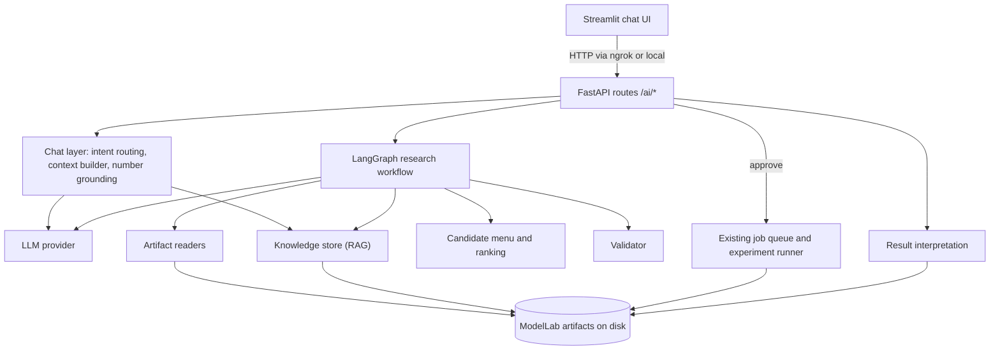
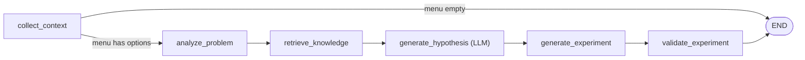
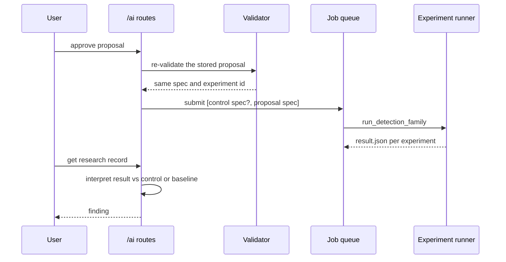

# ModelLab AI Advisor

An LLM and retrieval (RAG) layer on top of ModelLab's experiment engine. It reads the results ModelLab already produces for an object detection model, explains where the model fails, proposes **one validated experiment at a time**, waits for a human to approve it, runs it through the existing engine, and interprets the outcome.

It is built around one rule: **the language model never executes anything and never invents configuration.** Measurements, search space, validation, execution and result interpretation are deterministic code. The model's job is to choose between pre-validated options, justify the choice using retrieved evidence, and answer questions about the results in plain language.

- [What it takes and what it outputs](#what-it-takes-and-what-it-outputs)
- [Architecture](#architecture)
- [How each part works](#how-each-part-works)
- [The conversation layer](#the-conversation-layer)
- [Data formats](#data-formats)
- [HTTP API](#http-api)
- [Setup and configuration](#setup-and-configuration)
- [Design guarantees](#design-guarantees)
- [Testing](#testing)
- [Limitations](#limitations)
- [Repository layout](#repository-layout)
- [Extending it](#extending-it)

---

## What it takes and what it outputs

### Inputs

The system reads artifacts ModelLab has already written to its workspace. It does not need new data.

| Input | Where it comes from | Required | Used for |
|---|---|---|---|
| **Experiment family id** | `artifacts/experiments/<family_id>/baseline.json` | **Yes** | Baseline metrics, per-class results, model and dataset ids |
| Past experiment results | `artifacts/experiments/<family_id>/exp_*/result.json` | No (used if present) | Retrieval, ranking, "already tried" filtering, control detection |
| Failure analysis | `artifacts/failure_analyses/<id>/{metadata,per_class,report}.json` | No | Per-class counts (support, TP, FP, FN) and extra context |
| Dataset audit | `artifacts/audits/<id>/*.json` | No | Dataset quality context for the model |
| A user message | Chat input or `POST /ai/research` | Yes | The question or request |
| LLM backend | Environment variables | No | Without one, the system falls back to a rule-based choice |

Only **detection** families are supported. A classification family is rejected with a clear error.

### Outputs

| Output | Form | Produced by |
|---|---|---|
| **Analysis** | Overall precision, recall, F1; weak classes with evidence; data issues (for example "this class has no ground-truth objects in the evaluation set") | Deterministic code |
| **Hypothesis** | One claim, a rationale, evidence lines, and an evidence level (`low` or `medium`) with the reasons behind it | LLM picks and words it; evidence is computed |
| **Ranking** | Every available option with a score and the reasons for it | Deterministic code |
| **Experiment proposal** | A validated `ExperimentSpec`, its settings, and a deterministic experiment id | Catalog plus validator |
| **Execution** | A background job through ModelLab's existing experiment runner, optionally with a default-settings control run | Existing engine |
| **Finding** | Verdict (`improved`, `no_meaningful_change`, `worsened`, `failed`, `unavailable`), comparison table, caveats | Deterministic code |
| **Answers** | Free-text answers to questions, with a warning on any figure that is not in the data the model was given | LLM plus a grounding check |
| **Report** | A markdown document covering the whole research record and, optionally, the conversation | Deterministic template |

Every research result is stored as JSON (see [Data formats](#data-formats)) and returned by the API.

---

## Architecture



The advisor adds new code next to ModelLab and does not modify the training engine. The only change to existing code is registering the routes in `server/app.py` (two lines).

### The research workflow (LangGraph)

A single, linear graph. There is no autonomous loop and no multi-agent behavior.



Only `generate_hypothesis` calls the LLM. Every other node is deterministic.

### Approval and execution



---

## How each part works

### 1. LLM layer (`llm/provider.py`)

All model access goes through one abstraction, so nothing else in the system knows which model is running.

| Backend | `MODELLAB_LLM_BACKEND` | Notes |
|---|---|---|
| llama.cpp, in-process | `llama_cpp` (default) | Loads a GGUF model through `llama-cpp-python`. Structured calls use llama.cpp's JSON-schema constrained decoding (`response_format`). CPU by default. |
| OpenAI-compatible HTTP | `openai_compat` | For a local Ollama or llama.cpp server. No constrained decoding, so it relies on the validation and retry loop below. |
| None | `none` | Always raises, which triggers the rule-based fallback. Useful to test the whole pipeline without a model. |
| Scripted | (tests only) | Returns canned replies. |

Default model: `Qwen/Qwen2.5-1.5B-Instruct-GGUF`, Q4_K_M quantization (about 1 GB). Any GGUF chat model works, for example Mistral 7B Instruct on a machine with enough memory (set `MODELLAB_LLM_PATH`).

**Structured generation.** `generate_structured(system, user, schema, check=None)`:

1. Appends the Pydantic JSON schema to the system prompt and asks for one JSON object.
2. Extracts the JSON from the reply (strips code fences and surrounding text).
3. Validates it with Pydantic, then runs an optional `check` callback that can return a problem description.
4. On any failure, appends the model's reply and a "that reply was rejected: *reason*" message and asks again, up to 2 retries (3 attempts).
5. If every attempt fails, raises `LLMError`. Callers turn that into a rule-based fallback and record it in the result's `notes`.

For models without a system role, the system text is merged into the first user message.

**Free-text generation.** `generate_text(system, user, history)` is used for chat answers.

### 2. Deterministic analysis (`analysis.py`)

Reads per-class results in either of ModelLab's two shapes (failure-analysis style with `support`, evaluation style with `tp/fp/fn`) and normalizes them.

- A class is a **recall weakness** if it has ground-truth objects and recall is below 0.5.
- A class is a **precision weakness** if it has more false positives than true positives.
- A class with **no ground-truth objects** in the evaluation set is reported as a **data issue**, not as a weakness: its recall is undefined and its false positives cannot be judged.
- A class under 5% of all ground-truth objects is flagged as rare.
- The **primary target** is whichever of overall recall and precision is lower.

### 3. Retrieval, RAG (`knowledge/`)

The knowledge base is ModelLab's own history, not external literature. The question it answers is "what happened in my experiments?".

**Documents.** Each is a `KnowledgeDocument` (`id`, `source_type`, `source_id`, `title`, `content`, `metadata`) built from artifacts, detection only:

| Source | Content |
|---|---|
| `experiment` | Settings changed from the default training config, status, epochs, baseline vs trained vs delta for F1, precision, recall and mean IoU, and per-class results after training. Failed runs contain the error. |
| `evaluation` | Overall metrics and per-class counts. Evaluations produced by experiments are skipped to avoid duplicating experiment documents. |
| `failure_analysis` | Per-class rows and notes on classes with no ground truth. |

Documents are short, so each is embedded whole, with no chunking.

**Store.** `KnowledgeStore` supports `add` (upsert by content) and `search(query, top_k, source_type, filters)`. Vectors are L2-normalized and ranked by cosine similarity with NumPy. Persistence is `knowledge/index.json` plus `knowledge/vectors.npy` under the artifacts directory. If the embedder changes, the store re-embeds from the stored documents automatically.

**Embedders.** `all-MiniLM-L6-v2` on CPU by default. A deterministic hashing embedder (no download, lower quality) is used as a fallback if the model cannot load, or by choice with `MODELLAB_EMBEDDER=hashing`.

**When retrieval happens.** After the deterministic analysis, using a query built from that analysis (primary target and the weakest class names). It does not retrieve on the raw user prompt. Retrieval is scoped to the family and returns the top 3 experiment documents.

### 4. Search space and validation (`catalog.py`, `validation.py`)

The model cannot propose arbitrary configuration. The catalog is an explicit whitelist of settings that the detection trainer actually honors, each with a type and range, for example:

`epochs`, `data.input_width` / `data.input_height` (224, 320, 416, 512, 640), `data.batch_size`, `optimizer.name`, `optimizer.learning_rate`, `optimizer.weight_decay`, `scheduler.name` (`none` or `cosine`), `early_stopping_patience`, `mixed_precision`, and the augmentation fields that map to the detector (`enabled`, `probability`, `rotation_degrees`, `saturation_factor`, `brightness_factor`, `horizontal_flip`).

Settings that exist in the training config but are **not** applied by the detection trainer (freeze, loss, sampler, gradient accumulation, gradient clipping, and the other augmentation fields) are rejected with an explicit reason. Without this, an "experiment" could silently be identical to the baseline.

`validate_changes` runs a fixed pipeline: catalog and range checks (at most 4 changes, no duplicates, width and height set together) -> build and apply a `TrainingIntervention` onto a default `TrainingConfig` -> parse a full `ExperimentSpec` -> compute the deterministic experiment id. The result is a `ValidationResult` with `valid`, `errors`, `experiment_id` and the serialized `spec`.

### 5. Options and ranking (`catalog.py`, `ranking.py`)

The advisor offers eight pre-defined options: input resolution 416 or 512, 30 epochs, learning rate 1e-4, cosine schedule, geometric augmentation, colour augmentation, batch size 16. An option is removed if a completed experiment already contains all its settings, or if it was already proposed in the current chat.

Remaining options are scored with transparent rules:

| Rule | Score |
|---|---|
| Option targets the weaker overall metric | +1.0 |
| Option increases epochs beyond the longest past run (runs with no `epochs` change count as 10) | +1.5 |
| A past completed experiment changed the same setting and moved the option's target metric up | +0.5 |
| Resolution 512 (higher training cost) | -0.5 |

Evidence level is `medium` at a score of 2.0 or more, otherwise `low`. The reasons are kept and shown to the user. The model is never asked for a confidence number, because a small model cannot calibrate one.

### 6. Hypothesis selection (`research/nodes.py`)

The LLM receives the measured summary, weak classes, data issues, the audit digest if attached, the retrieved experiment notes, and the **top 3** ranked options with their reasons. It must return `candidate_id`, `claim` and `rationale`. Extra fields are ignored.

Two checks run on every reply and trigger a retry with the reason if violated:

- `candidate_id` must be one of the offered top 3.
- If there are weak classes, the claim must **name** at least one of them. This blocks generic claims that restate option descriptions instead of the data.

If the model cannot produce a valid reply, the top-ranked option is chosen by rule, `llm_used` is `false`, and a note explains why. The proposal itself (name, settings, expected effect) always comes from the catalog, not from the model's text.

### 7. Approval and execution (`routes.py`)

Approving a proposal does not trust the client. The server re-validates the stored proposal and checks it still produces the same experiment id (this catches a tampered record), checks the model and dataset exist, and submits the spec to ModelLab's existing job queue and `experiments` service. Model and dataset ids default to the ones recorded in the family baseline.

**Control run.** A gain from a trained experiment is confounded with the effect of retraining itself. So by default, if the family has no default-settings control, approval submits one first (`advisor_control_default`, which equals the default training config) followed by the proposal. If a control already exists (a completed run whose config equals the defaults), it is reused. The user can opt out with `include_control: false`.

Approving twice returns 409 unless `force` is set. With `force`, a result file older than the new approval is treated as stale and ignored.

### 8. Result interpretation (`finding.py`)

Fully deterministic. For the proposal's target metric:

- Reference is the **control run** if available, otherwise the **baseline model**.
- `improved` if the change is at least +0.01, `worsened` if at most -0.01, otherwise `no_meaningful_change`.
- The summary also reports the change against the baseline model, and lists any other metric that dropped by 0.01 or more.
- Caveats are attached: it is a single run with no significance test, and, when no control exists, that part of the change may come from retraining itself.
- A failed run reports the recorded error. A missing comparison reports `unavailable`.

---

## The conversation layer

The chat turns the pipeline above into a conversation. Each message is handled independently, so the dialogue does not need a fixed script.

**Routing.** A small keyword router decides what a message does:

| Intent | Triggered by | Result |
|---|---|---|
| `report` | "report", "export", "write-up", "download" | Builds a markdown report for the latest research in the chat |
| `propose` | "propose", "suggest", "another", "try", "improve", "what should I...", or a general "why is my detector weak" | Runs the research workflow and returns a proposal card |
| `ask` | everything else, including questions that name a specific class | LLM answer grounded in the data |

Routing is rule-based on purpose, because a small model misroutes. The LLM does the answering.

**Context for answers.** For an `ask` message the context is built from: baseline summary and per-class rows, data issues, a compact list of experiments run, the top 3 related experiment notes retrieved for the question, the digest of an attached dataset audit and failure-analysis report, and the latest proposal and result in the chat. It is capped at about 7,000 characters, trimming the audit and failure digests first. The last 6 text turns are sent as history.

**Digests.** Audit and failure-analysis files have arbitrary JSON structure, so they are summarized generically: at most 20 keys per object, the first 3 items of any list plus the count, floats rounded to 4 places, long strings truncated, and the depth reduced until the result fits the character budget.

**Number grounding.** After the model answers, every decimal and percentage in the answer is compared against the numbers in the context it was given. Any that do not appear are listed in a warning under the message. Percent and decimal forms are matched to each other (15.5% and 0.155). Derived numbers (such as 190 of 238 expressed as 79.8%) are flagged too, by design.

**Fallbacks.** If the LLM backend is unavailable or fails, `ask` returns a deterministic summary of the data, and `propose` still returns a valid proposal chosen by rule, with a note saying the model was unavailable.

**Report export.** Sections: question and context, baseline, analysis and data notes, past experiments consulted, hypothesis with evidence level and reasons, all options considered, the proposed experiment, execution details, the finding with its comparison table and caveats, and optionally the conversation transcript.

**UI.** A Streamlit app (`ai_panel.py`) with a chat input pinned to the bottom, a sidebar to start a chat (experiment family required, audit and failure analysis optional) and to switch between chats, and structured cards in the conversation. It talks to the backend over HTTP and sends the header that makes ngrok skip its browser warning page. It needs only `streamlit` and `requests` and does not import `modellab`.

---

## Data formats

Abridged examples. Values are illustrative.

### Research record

```json
{
  "id": "res_20261007T071906_c256df",
  "family_id": "weapons-final-model",
  "question": "Why is my weapon detector weak?",
  "status": "proposed",
  "defaults": {"model_id": "weapons-final-model", "dataset_id": "weapons-small"},
  "result": {
    "llm_used": true,
    "failure_source": "failure_analysis:fa1",
    "baseline_metrics": {"precision": 0.165, "recall": 0.155, "f1": 0.160, "num_samples": 472},
    "analysis": {
      "summary": "Overall precision 0.165, recall 0.155, f1 0.160 over 472 samples. Weakest: handgun precision 0.012 (81 false positives vs 1 correct detections).",
      "weaknesses": [
        {"class_name": "handgun", "metric": "recall", "value": 0.013, "support": 78, "note": "77 of 78 objects missed"}
      ],
      "data_issues": ["sword has no ground-truth objects in the evaluation set, so its recall is undefined and its 9 false positives cannot be judged"],
      "primary_target": "recall"
    },
    "retrieved": [{"id": "experiment:weapons-final-model:exp_d377bb24076c", "title": "Experiment exp_d377bb24076c: epochs=1, optimizer.learning_rate=0.0002", "score": 0.613}],
    "ranking": [
      {"candidate_id": "epochs_30", "score": 2.0, "level": "medium", "reasons": ["the longest past run trained 1 epoch, this trains 30", "exp_d377bb24076c changed the same setting and moved f1 by +0.040"]}
    ],
    "hypothesis": {
      "claim": "Training for 30 epochs should lift f1, starting with handgun recall",
      "rationale": "The only past run trained one epoch and improved every metric.",
      "evidence": ["handgun recall 0.013 (77 of 78 objects missed)"],
      "expected_direction": "improve",
      "target_metric": "f1",
      "evidence_level": "medium",
      "evidence_reasons": ["the longest past run trained 1 epoch, this trains 30", "exp_d377bb24076c changed the same setting and moved f1 by +0.040"]
    },
    "proposal": {
      "name": "advisor_epochs_30",
      "candidate_id": "epochs_30",
      "changes": [{"path": "epochs", "value": 30}],
      "expected_effect": "f1 should increase",
      "reason": "Training for 30 epochs should lift f1, starting with handgun recall"
    },
    "validation": {"valid": true, "errors": [], "experiment_id": "exp_6807c67f48cb", "spec": {"...": "full ExperimentSpec"}},
    "notes": [],
    "trace": ["collect_context", "analyze_problem", "retrieve_knowledge", "generate_hypothesis", "generate_experiment", "validate_experiment"]
  },
  "approval": null,
  "finding": null
}
```

After approval, `approval` records the job id, model and dataset, and the control experiment id. After the experiment finishes, `finding` is filled in.

### Finding

```json
{
  "verdict": "improved",
  "hypothesis_status": "consistent with the hypothesis",
  "target_metric": "recall",
  "basis": "control",
  "summary": "recall went from 0.300 to 0.400 (+0.100) against the default-settings control. Against the baseline model the change is +0.245.",
  "reference": {"f1": 0.25, "precision": 0.20, "recall": 0.30, "mean_iou": 0.85},
  "trained":   {"f1": 0.30, "precision": 0.25, "recall": 0.40, "mean_iou": 0.90},
  "delta":     {"f1": 0.05, "precision": 0.05, "recall": 0.10, "mean_iou": 0.05},
  "delta_vs_baseline": {"f1": 0.14, "precision": 0.085, "recall": 0.245, "mean_iou": 0.15},
  "caveats": ["single run, no significance test"]
}
```

### Chat message

```json
{
  "id": "m2", "role": "assistant", "kind": "research",
  "text": "Here is what I found and the experiment I would run next.",
  "research_id": "res_20261007T071906_c256df",
  "report": null, "warning": null,
  "research": {"...": "the research record above, with live status, job and finding"}
}
```

`kind` is `text`, `research` or `report`. A `report` message carries the markdown in `report`. A `text` message may carry a grounding `warning`.

### Storage

All state is plain JSON under the ModelLab artifacts directory: `ai_research/<id>/research.json`, `ai_chats/<id>/chat.json`, and `knowledge/{index.json,vectors.npy}`. Writes are atomic (write to a temp file, then rename).

---

## HTTP API

All routes are under `/ai`. Errors use ModelLab's existing error format: `404` not found, `409` conflict (already approved or rejected), `422` invalid input or context, `503` LLM backend unavailable.

| Method and path | Body | Returns |
|---|---|---|
| `GET /ai/context-options?family_id=` | none | Available families, audits, and failure analyses (those matching the family's baseline first) |
| `POST /ai/chats` | `family_id`, `audit_id?`, `analysis_id?` | New chat |
| `GET /ai/chats` | none | Chat summaries, newest first |
| `GET /ai/chats/{id}` | none | Chat with all messages, research cards hydrated with live status |
| `POST /ai/chats/{id}/messages` | `text` (1 to 2000 chars) | Updated chat. A failed message is not saved. |
| `POST /ai/chats/{id}/context` | `audit_id?`, `analysis_id?` | Updated chat (null clears) |
| `POST /ai/research` | `family_id`, `question?`, `audit_id?`, `analysis_id?` | Research record |
| `GET /ai/research` / `GET /ai/research/{id}` | none | List / one record (with job status and finding when available) |
| `POST /ai/research/{id}/approve` | `include_control?`, `model_id?`, `dataset_id?`, `subpath?`, `device`, `force` | `202` with the job and control info |
| `POST /ai/research/{id}/reject` | none | Updated record |
| `GET /ai/research/{id}/report` | none | Markdown (`text/markdown`) |

---

## Setup and configuration

### Dependencies

Server: `pydantic`, `numpy`, `langgraph`, `fastapi` (already used by ModelLab), plus one LLM backend (`llama-cpp-python`, or `openai` for an OpenAI-compatible server) and optionally `sentence-transformers` for the MiniLM embedder.

UI: `streamlit` and `requests`.

### Wiring the routes

Add these two lines in `server/app.py`, after `add_pipeline_routes(...)`:

```python
from modellab.ai.routes import add_ai_routes

add_ai_routes(api, ws, jobs, cache, store)
```

Or run the included patch script, which makes a backup and refuses to edit if it cannot find the anchor line exactly once:

```bash
python apply_ai_routes_patch.py
```

### Environment variables

| Variable | Default | Meaning |
|---|---|---|
| `MODELLAB_LLM_BACKEND` | `llama_cpp` | `llama_cpp`, `openai_compat` or `none` |
| `MODELLAB_LLM_PATH` | unset | Local GGUF file (takes priority over repo and file) |
| `MODELLAB_LLM_REPO` | `Qwen/Qwen2.5-1.5B-Instruct-GGUF` | Hugging Face repo to download from |
| `MODELLAB_LLM_FILE` | `*q4_k_m.gguf` | File name or glob in that repo |
| `MODELLAB_LLM_CTX` | `4096` | Context window |
| `MODELLAB_LLM_THREADS` | auto | CPU threads |
| `MODELLAB_LLM_GPU_LAYERS` | `0` | Layers to offload to GPU |
| `MODELLAB_LLM_BASE_URL`, `MODELLAB_LLM_MODEL`, `MODELLAB_LLM_API_KEY` | unset | For `openai_compat` |
| `MODELLAB_EMBEDDER` | `minilm` | `minilm` or `hashing` |
| `MODELLAB_URL` | `http://127.0.0.1:8000` | Backend URL used by the Streamlit app |

### Running

```bash
# CPU wheel of llama-cpp-python
pip install llama-cpp-python --extra-index-url https://abetlen.github.io/llama-cpp-python/whl/cpu

# start the ModelLab server as usual, then locally:
MODELLAB_URL=https://<your-backend-url> streamlit run ai_panel.py
```

Set the environment variables in the process that starts the server, and restart it after changing them. To try the pipeline without any model, set `MODELLAB_LLM_BACKEND=none`.

---

## Design guarantees

- **No model-authored configuration.** Every proposed setting comes from the catalog and passes the validator. The model chooses among options and writes text.
- **No execution without approval.** Nothing is trained until a human approves, and approval re-validates the stored proposal server-side.
- **Evidence is computed, not claimed.** Evidence level and the ranking come from rules over the data. The model's own confidence is never used.
- **Grounded text.** Claims must name a weak class from the results, and figures in free-text answers are checked against the data.
- **Graceful degradation.** If the model is missing or fails, the system still analyzes, proposes a valid experiment by rule, and says so.
- **Honest comparison.** Results are compared with a default-settings control when one exists, and the finding states which reference was used and what it cannot show.
- **Isolation.** The advisor does not modify training code, and its state is separate JSON files.
- **Concurrency.** LLM calls are serialized with a lock (one local model, one request at a time).

---

## Testing

The suite lives in `tests/unit/test_ai_*.py` with shared fixtures in `tests/ai_fixtures.py`. Run it with `python -m pytest tests/unit/test_ai_*.py -q`.

| Area | What is covered |
|---|---|
| Validator and catalog | Valid and invalid paths and values, ranges, type strictness (booleans are not integers), duplicate and oversize changes, deterministic experiment ids, every catalog option validates |
| Knowledge | Config-diff extraction, document building for completed and failed runs, ingestion that skips malformed files, search, filters, upsert, persistence, re-embedding on embedder change |
| LLM layer | JSON extraction, retry with feedback, `check` callbacks, retry limit, schema strictness, system-message merging, free-text generation |
| Research graph | Node order, retrieval, fallback on LLM failure, top-3 restriction, the grounding check, tried-option exclusion, early stop on an empty menu, path sanitising |
| Ranking and findings | Each scoring rule, evidence level, control versus baseline reference, failed or missing controls |
| API | Full flows through a real FastAPI test client: research, approve, reject, force, stale results, tampered records, control reuse, chats, context, reports, error handling |
| Chat | Intent routing, number grounding (including false-positive regressions), digests, LLM-unavailable fallbacks, exhausting the option menu |
| UI | Streamlit's `AppTest` drives the whole conversation: start, propose, approve, result, follow-up, reject, context change, switching chats, backend errors |

During development, key behaviors were also checked by deliberately breaking them (mutation testing) to confirm the tests fail when they should, and the UI was exercised end to end in a headless browser. UI tests are skipped automatically if Streamlit is not installed.

Not covered by automated tests: the quality of a real model's answers, and the first download and load of the real GGUF and embedding models.

---

## Limitations

- **Detection only.** Classification families are rejected.
- **Fixed option menu.** The advisor chooses among eight pre-defined experiments. It does not invent new ones, and adding options is a code change (see below).
- **Single runs.** A finding is one run, with no repetitions or significance test. A control run reduces, but does not remove, the risk of crediting the wrong cause.
- **Small-model quality.** Claims and answers from a small local model can be shallow or wrong. The grounding check catches invented figures, not wrong reasoning, and derived numbers are flagged conservatively.
- **Keyword routing.** A message can occasionally be routed to the wrong action. Rephrasing fixes it, and naming a class forces an explanation.
- **Settings the trainer ignores.** Freeze, loss, sampler, gradient accumulation and gradient clipping are excluded because the detection trainer did not apply them when this was built. Re-enable them in the catalog only after verifying the trainer honors them.
- **Evaluation data issues are surfaced, not fixed.** For example, classes with no ground-truth objects are reported but the evaluation set is not changed.
- **Context size.** The default context window is 4096 tokens, so audit and failure-analysis files are digested rather than read in full.
- **No authentication.** Access control is whatever protects the ModelLab server.
- **Knowledge scope.** Retrieval covers ModelLab's own artifacts only. There is no external literature or web search.

---

## Repository layout

```
src/modellab/ai/
  schemas.py            Pydantic models: analysis, candidates, hypothesis, proposal, validation, ranking
  analysis.py           Per-class normalization, weaknesses, data issues
  catalog.py            Whitelist of settings, option menu, "already tried" filtering
  validation.py         Proposal -> TrainingIntervention -> ExperimentSpec -> experiment id
  ranking.py            Option scoring and evidence level
  finding.py            Result interpretation (control or baseline reference)
  digest.py             Generic bounded JSON summarizer
  tools.py              Artifact readers and listings (baseline, experiments, audits, analyses, control lookup)
  chat.py               Intent routing, context builder, answer generation, number grounding
  report.py             Markdown report builder
  routes.py             FastAPI routes, research and chat storage, approval and execution
  llm/provider.py       LLM backends, structured and free-text generation
  knowledge/
    documents.py        KnowledgeDocument model
    store.py            Embedders and the vector store
    ingestion.py        Artifacts -> documents, config diffing
  research/
    state.py            Workflow state
    nodes.py            The six workflow nodes
    graph.py            LangGraph wiring and run_research()

ai_client.py            HTTP client used by the UI and the API tests
ai_panel.py             Streamlit chat UI
apply_ai_routes_patch.py   Adds the two route-registration lines to server/app.py
.streamlit/config.toml  UI theme

tests/ai_fixtures.py    Shared fakes for the API and UI tests
tests/unit/test_ai_*.py Unit, API and UI tests
```

---

## Extending it

- **Add an experiment option.** Add a candidate in `catalog._all_candidates` using only paths already in `RULES`. A test checks that every candidate passes the validator.
- **Allow a new setting.** Add it to `RULES` with a type and range, but only after confirming the detection trainer applies it. Otherwise add it to `UNSUPPORTED` with the reason.
- **Change the scoring.** Edit `ranking.rank_candidates`. Each rule appends its own reason, so the UI explains itself.
- **Use a different model.** Set `MODELLAB_LLM_PATH`, or point `openai_compat` at an Ollama or llama.cpp server. No code changes.
- **Use a different embedder.** Any object with a `name` and an `embed(texts)` method returning normalized vectors works with `KnowledgeStore`.
- **Better audit context.** `tools.audit_digest` is generic. A summarizer written for the audit report's real schema would give the model sharper input.
